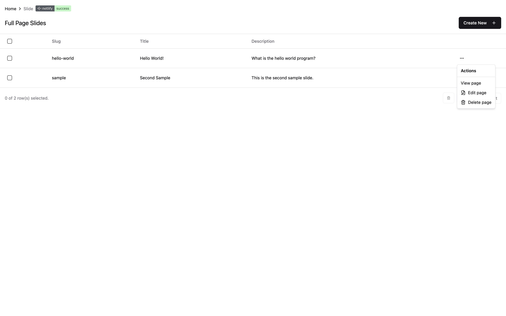
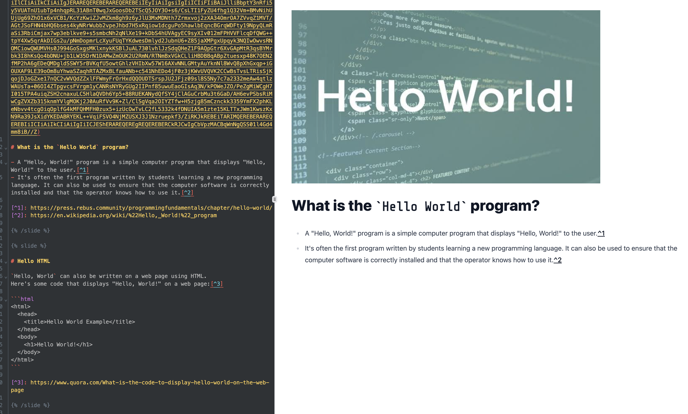
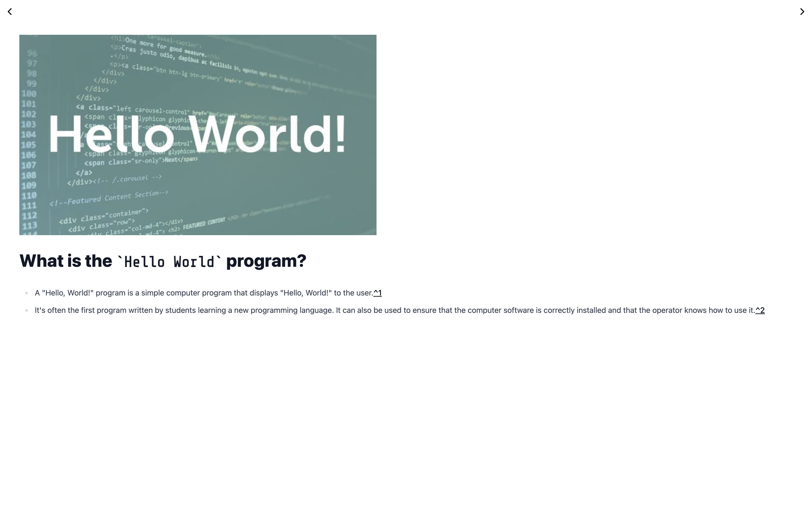

## Introduction

Appcraft Astro is an improved version of the original [AppCraft](/project/appcraft). It is built using SolidJS, TypeScript, TailwindCSS, and Astro. The primary objective was to greatly simplify the process of creating and deploying web apps. It is also built with a better stack and more features.

## Demo

Find a usage demo of AppCraft Astro [here](https://appcraft.netlify.app/).

## Screenshots

