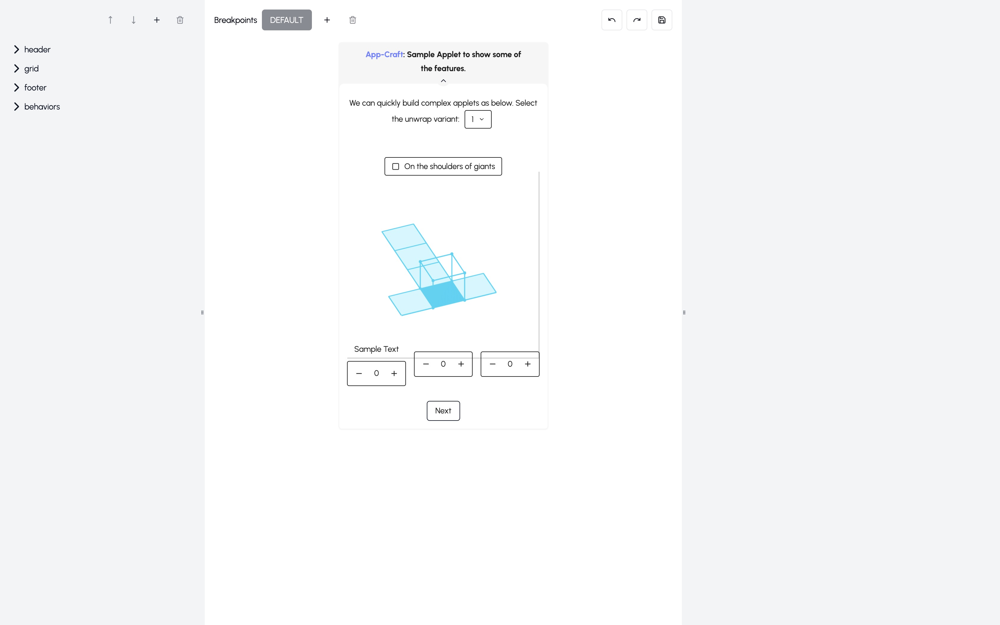

## Introduction

AppCraft is a no code tool to easily build web applets with full customizable reactivity. It is built using React, TypeScript, TailwindCSS, and Redux. The primary objective was to simplify the creation of Math applets for the Byju's Math companion product.

## Screenshots

